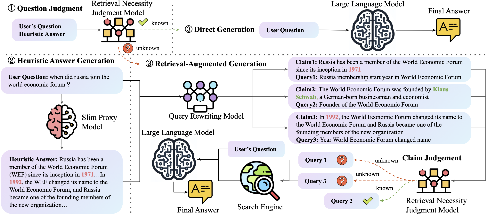

# SlimPLM


<p align="center">
📝 <a href="https://arxiv.org/abs/2402.12052" target="_blank">Paper</a> • 🤗 <a href="https://huggingface.co/zstanjj/SlimPLM-Query-Rewriting/" target="_blank">Hugging Face</a> • 🧩 <a href="https://github.com/plageon/SlimPLM" target="_blank">Github</a>
</p>

The code repository for the anonymous submission for ACL 2024:
_Detect Missing Knowledge in LLMs with Slim Proxy Language Model_.



## Pre-requisites
### Environment
Prepare python environment with the following command:
```bash
# https://github.com/castorini/pyserini/blob/master/docs/installation.md
conda create -n pyserini python=3.10 -y
conda activate pyserini
# install jdk and maven
conda install -c conda-forge openjdk=11 maven -y
# https://pytorch.org/get-started/locally/
# https://pytorch.org/get-started/previous-versions/
conda install pytorch==2.0.1 torchvision==0.15.2 torchaudio==2.0.2 pytorch-cuda=11.7 -c pytorch -c nvidia
# https://github.com/facebookresearch/faiss/blob/main/INSTALL.md
conda install -c conda-forge faiss-gpu
pip install pyserini pymongo dgango
# -i https://pypi.tuna.tsinghua.edu.cn/simple
pip install scikit-learn transformers transformers[deepspeed] rouge_score evaluate dataset gpustat
```

Build a vllm environment for Qwen-72B-Chat inference with the following command:
```bash
# (Optional) Create a new conda environment.
conda create -n vllm python=3.9 -y
conda activate vllm

# Install vLLM with CUDA 12.1.
pip install vllm
pip install flash-attn --no-build-isolation
```

### Search Corpus Preparation
Build kilt data corpus, please refer to [kilt](https://github.com/facebookresearch/KILT) for more details.
```bash
# prepare mongodb for kilt data corpus
conda install -c anaconda mongodb
conda install -c conda-forge mongo-tools
wget http://dl.fbaipublicfiles.com/KILT/kilt_knowledgesource.json
mongoimport --db kilt --collection knowledgesource --file kilt_knowledgesource.json
mongod --dbpath ./mongodb/ --fork --logpath mongod.out
```
```bash
#rerank and retrieval API build up
#using django to build up the API
cd pyserini/searchServer
nohup python ./manage.py runserver 0.0.0.0:5050 > django.out &
```

### Data Preparation
For ASQA, NaturalQuestions, TriviaQA, and ELI5, please download the data from [kilt](https://github.com/facebookresearch/KILT).

For MuSiQue, please download the data from [MuSiQue](https://github.com/StonyBrookNLP/musique).

The sampled test set ids are provided in [user_intent_data](./user_intent_data) directory.

## SlimPLM
### Model Fine-tuning
Prepare fine-tuning data for retrieval necessity judgment model, please refer to [prepare_data.ipynb](jupyter/prepare_data.ipynb).

We release our fine-tuning data for retrieval necessity judgment model in [v0104](./user_intent_data/mixed/v0104/).
The fine-tuning data for query rewriting model is released in [v0118](./user_intent_data/mixed/v0118/).

The fine-tuned retrieval necessity judgment model is released in [huggingface](https://huggingface.co/zstanjj/SlimPLM-Retrieval-Necessity-Judgment), and the query rewriting model is released in [huggingface](https://huggingface.co/zstanjj/SlimPLM-Query-Rewriting/).

### Model Inference
Prepare fine-tuning data for query rewriting model, please refer to [gpt4_annotation.sh](scripts/gpt4_annotation.sh) and [seperate_claims.sh](scripts/seperate_claims.sh).

Run chat inference for proxy language model or large language model, please refer to [chat_inference.sh](scripts/chat_inference.sh).

Run inference on the fine-tuned retrieval necessity judgment model or query rewriting model, please refer to [query_rewrite_inference.sh](scripts/query_rewrite_inference.sh).

### Reproduce Results
Follow these steps to reproduce the results in the paper.

1. Reproduce Direct Chat results, run chat inference for proxy language model or large language model. Make sure the "prompt_method" is "without_search".
2. Run inference on retrieval necessity judgment model, make sure the "rewrite_model" is "v0104".
3. Parse llama judge output strings. Please refer to scripts in [prepare_data.ipynb](jupyter/prepare_data.ipynb).
4. Run inference on query rewriting model, make sure the "rewrite_model" is "v0108".
5. Parse llama question rewrite & separate claim results. Please refer to scripts in [prepare_data.ipynb](jupyter/prepare_data.ipynb).
6. Run search inference using scripts in [scripts/search_pipeline_apply.sh](scripts/search_pipeline_apply.sh).
7. Run rerank inference using scripts in [scripts/rerank_passage.sh](scripts/rerank_passage.sh).
8. Run evaluation on large language model using rag. Please make sure the "prompt_method" is "v0118{proxy_model_name}_rewrite_search", such as "v0118llama7b_rewrite_search".

### Evaluation
Run evalation for short form answer dataset or long form answer dataset, please refer to [evaluation_scripts.sh](jupyter/evaluation_scripts.ipynb).

## Baselines

Run SKR knn baseline, please prepare data using [prepare_data.ipynb](jupyter/prepare_data.ipynb), and refer to [skr_knn.sh](baseline_scripts/skr_knn.sh).

Run Self-Eval baseline, please refer to [self_eval.sh](baseline_scripts/self_eval.sh).

Run ITER-RETGEN baseline, please refer to [itergen_chat.sh](baseline_scripts/itergen_chat.sh) and [itergen_search.sh](baseline_scripts/itergen_query_search.sh).

Run Self-Ask baseline, please refer to [selfask_chat.sh](baseline_scripts/selfask_chat.sh), [selfask_reader.sh](baseline_scripts/selfask_reader.sh), and [selfask_search.sh](baseline_scripts/selfask_search.sh).

## Citation
If you use the code in this repository, please cite the following paper:
```
@inproceedings{Tan2024SmallMB,
  title={Small Models, Big Insights: Leveraging Slim Proxy Models To Decide When and What to Retrieve for LLMs},
  author={Jiejun Tan and Zhicheng Dou and Yutao Zhu and Peidong Guo and Kun Fang and Ji-Rong Wen},
  year={2024},
  url={https://arxiv.org/abs/2402.12052}
}
```


